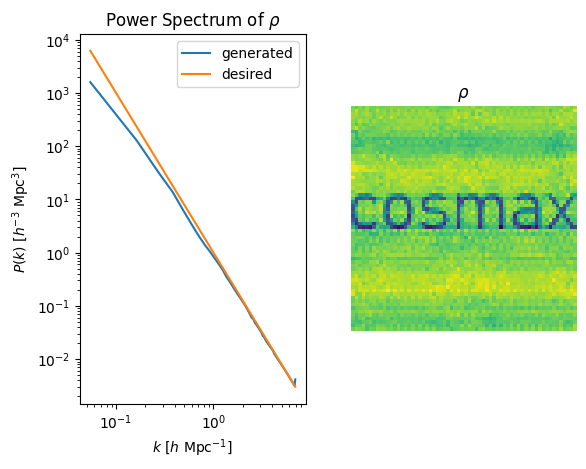

# Cosmax

Fast and differentiable tools for analysis and inference on structured and unstructured data in cosmology. Powered by JAX. 

Install with `pip install cosmax`.

## What can I do with this package?

### Classical Use Cases

Generate the [Matter Power Spectrum](examples/power_spectrum.ipynb) from a 3D densitiy field:


Generate the [ICs for a given matter power spectrum](examples/generate_ic.ipynb):


Cloud in a cell mass assignment scheme to [convert unstructured particles to a 3D density field](examples/cic.ipynb):


### Optimization

With gradient optimization over the cic mass assignment scheme, we can find the particle positions that best [fit an observed density field](examples/fit.ipynb):


We can also use the power spectrum as a loss function to find a [conditional IC density field ](examples/conditional_ic.ipynb):



## What are the limitations?

- The package is currently in development and the API is not stable.
- The package generally ONLY works with 3D square boxes and periodic boundary conditions.
- I am not a physicist, so the package may contain errors and inaccuracies.

## Development

To develop, clone the repository and install the package in editable mode:

```
pip install -e .
```

To release as pip package, tests, docs and builds are handled automatically by github actions as defined in
.github/workflows. To make a new release:

```
git tag v*.*.*
git push origin v*.*.*
```
and change the version number in pyproject.toml.

### Test

```
pytest
```

### Build 

```
python -m build
```

### Local Docs

With the pip package sphinx installed, run

```
sphinx-apidoc -o docs/source cosmax/
sphinx-build -b html docs/source docs/_build
```

to view locally

```
cd docs/_build
python -m http.server
```

## Acknowledgements

- [PowerBox](https://powerbox.readthedocs.io/en/latest/) was used as a reference implementation the matter power spectrum.

- [Felix Köhler](https://github.com/Ceyron/machine-learning-and-simulation/)s implementation of Fourier Neural Operator was used as a guide to adapt the fno to jax and equinox.

- The original [NeuralOperator](https://github.com/neuraloperator/neuraloperator) served as a reference for the fno implementation.
