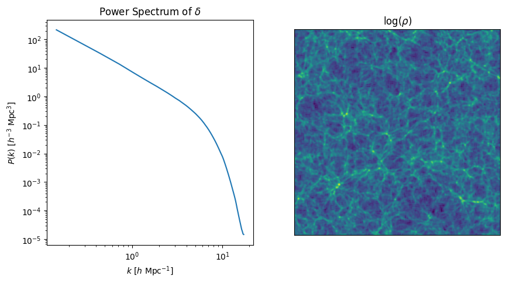

# Cosmax

Fast and differentiable tools for analysis and inference on structured and unstructured data in cosmology. Install with
```pip install cosmax```.

## What can I do with this package?

### Classical Use Cases

Generate the [Matter Power Spectrum](examples/power_spectrum.ipynb) from a 3D densitiy field:



Generate the [ICs for a given matter power spectrum](examples/generate_ic.ipynb):


Cloud in a cell mass assignment scheme for [density field to grid](examples/cic.ipynb):


### Exploiting the differentiability

## Development

To develop, clone the repository and install the package in editable mode:

```
pip install -e .
```

To release as pip package, tests, docs and builds are handled automatically by github actions as defined in
.github/workflows. To make a new release:

```
git tag v*.*.*
git push origin v*.*.*
```
and change the version number in pyproject.toml.

### Test

```
pytest
```

### Build 

```
python -m build
```

### Local Docs

With the pip package sphinx installed, run

```
sphinx-apidoc -o docs/source cosmax/
sphinx-build -b html docs/source docs/_build
```

to view locally

```
cd docs/_build
python -m http.server
```

## Acknowledgements

[PowerBox](https://powerbox.readthedocs.io/en/latest/) was used as a reference implementation the matter power spectrum.